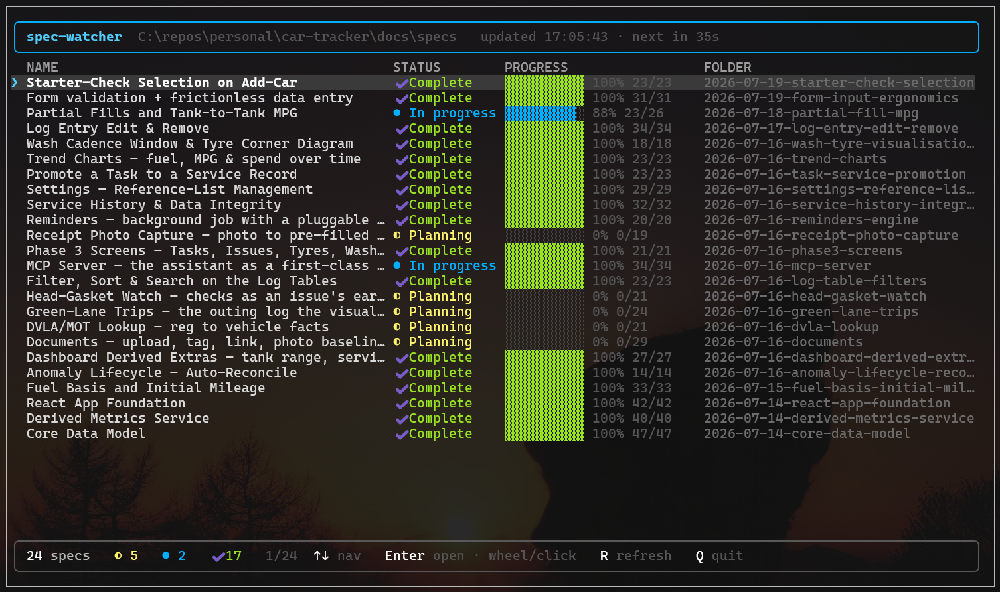
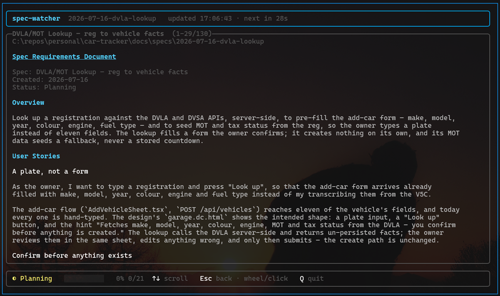

# spec-watcher

A full-screen terminal dashboard that watches a repository's specs folder and shows every spec's
**name, status, and task progress** in one live, navigable table. Arrow-key/mouse navigation with a
per-spec detail view that shows the whole spec.

Built for the Agent OS spec convention: one date-prefixed folder per spec under `docs/specs`, each
with a `spec.md` (blockquote header), `spec-lite.md` (one-paragraph summary), and usually a
`tasks.md` (checkbox tree).

List columns: **Name · Status · Progress · Folder**. Press **Enter** (or click a row) to open the
full spec + task checklist.



## Requirements

- .NET 10 SDK

## Run

```sh
# watch ./docs/specs of the current directory
dotnet run --project SpecWatcher.CLI

# watch another repo
dotnet run --project SpecWatcher.CLI -- C:\repos\personal\car-tracker

# custom specs folder and 30s interval
dotnet run --project SpecWatcher.CLI -- C:\repos\personal\car-tracker -s docs/specs -i 30
```

Build a binary:

```sh
dotnet build -c Release
# → SpecWatcher.CLI/bin/Release/net10.0/spec-watcher(.exe)
```

## Options

| Argument / Option        | Default              | Description                                   |
| ------------------------ | -------------------- | --------------------------------------------- |
| `[REPO_PATH]` (position) | current directory    | Repository root to watch.                     |
| `-s, --specs-path`       | `docs/specs`         | Specs folder, relative to the repo or absolute. |
| `-i, --interval`         | `60`                 | Auto-rescan interval in seconds (min 1).      |
| `--drift-idle-days`      | `0`                  | Flag In-progress specs untouched this many days as idle (`0` = off). |
| `--no-flags`             | off                  | Hide the drift/idle attention layer.          |
| `--once`                 | off                  | Scan once, emit the board to stdout, and exit. Never enters the TUI. |
| `-f, --format`           | `table`              | Output format: `table`, `json`, or `md`. `json`/`md` imply `--once`. |
| `--fail-on`              | none                 | Comma list of status keywords (`planning`, `in-progress`, `complete`, `unknown`); any matching spec fails the gate (exit `2`). |
| `--min-progress`         | none                 | `0`–`100`; any spec with tasks below N% complete fails the gate (exit `2`). |

## Headless & CI mode

`--once` (or any of `--format json|md`, `--fail-on`, `--min-progress`) runs a single scan, writes the
board to stdout in the chosen format, and exits — no TUI, no services, no persisted state. This is
also what happens automatically when output is piped or the terminal is non-interactive.

```sh
# machine-readable snapshot you can pipe into jq, a dashboard, or a badge generator
spec-watcher --once --format json

# GitHub-flavored Markdown table for a wiki / PR description / status email
spec-watcher --once --format md

# CI gate: fail the run (exit 2) if any spec is still planning or in progress
spec-watcher --fail-on planning,in-progress

# CI gate: fail if any spec with tasks is below 80% complete
spec-watcher --min-progress 80
```

**Exit codes:** `0` = scan succeeded and the gate passed (or none was set) · `1` = scan error
(missing specs dir / IO) · `2` = gate failure (a `--fail-on` match or `--min-progress` shortfall).
When a gate trips, the offending specs are listed in the output (and in the JSON `gate.violations`
block), and the board is still emitted first.

The `--format json` output is a **stable, versioned schema** (camelCase field names, kebab-case
`status`): it is the single source of truth a README status badge or `spec-status.json` integration
consumes, so it will only ever change additively.

## Keys & mouse

**List view**

| Input                    | Action                          |
| ------------------------ | ------------------------------- |
| `↑` / `↓`                | Move selection                  |
| `PgUp` / `PgDn` / `Home` / `End` | Jump                    |
| `Enter`                  | Open the selected spec          |
| **Left-click** a row     | Open that spec                  |
| **Scroll wheel**         | Move through the list           |
| `R`                      | Rescan immediately              |
| `Q` / `Esc`              | Quit                            |

**Detail view**

| Input                    | Action                          |
| ------------------------ | ------------------------------- |
| `↑` / `↓` / `PgUp` / `PgDn` / **wheel** | Scroll the spec  |
| **Drag** over text       | Select & auto-copy to clipboard |
| `Esc` / `Backspace` / `←`| Back to the list                |
| `Q`                      | Quit                            |

Mouse (wheel + click) is supported on Windows (Windows Terminal / conhost). A **left-drag** selects
text and copies it to the clipboard automatically on release (a plain click still opens the row) —
most useful in the detail view. The highlight clears on the next key press or scroll. On other
platforms, or when input is redirected, the app runs keyboard-only and your terminal's own
drag-to-select handles copying.

## How it reads a spec

- **Name** — the `> Spec:` line in `spec.md` (falls back to the de-slugged folder name).
- **Status** — the `> Status:` keyword → **Planning** / **In progress** / **Complete**. An all-checked
  `tasks.md` is treated as Complete even if the status line is stale.
- **Progress** — completed vs total `- [ ]` / `- [x]` checkboxes in `tasks.md` (shows `—` when absent).
- **Folder** — the raw folder slug, e.g. `2026-07-19-starter-check-selection`.
- **Detail view** — renders the full `spec.md` (Overview, User Stories, Scope, …) plus the `tasks.md`
  checklist, loaded fresh from disk when opened.



## Behavior notes

- The watch timer runs off the UI thread, so scanning never blocks input or redraws.
- Full-screen uses the terminal's alternate screen buffer and restores it on exit.
- On Windows, the console input mode is switched to deliver mouse events (QuickEdit is temporarily
  disabled) and restored on exit.
- When output is piped or the terminal is non-interactive, it takes the headless path (a single
  static table by default) and exits — see [Headless & CI mode](#headless--ci-mode).

## Project layout

```
SpecWatcher.slnx            # solution
SpecWatcher.CLI/            # the SpecWatcher.Console project
  SpecWatcher.Console.csproj
  Program.cs               # CommandApp entry point
  WatchSettings.cs         # CLI args/options + validation
  WatchCommand.cs          # Full-screen TUI: list + detail, nav, mouse, timer scan loop
  SpecScanner.cs           # Enumerate + parse spec folders (off-thread)
  SpecParser.cs            # Pure parsing of spec.md / spec-lite.md / tasks.md
  Models.cs                # SpecRow, SpecStatus, ScanResult, SpecDetail (immutable)
  Input/                   # IInputSource: Windows ReadConsoleInput (keys+mouse) + ReadKey fallback
docs/product/              # Mission, tech stack, roadmap, decisions
```
